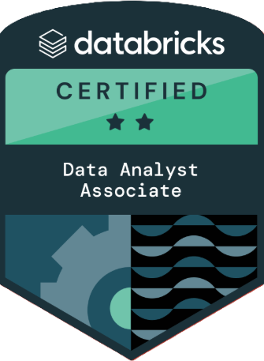

# 👋 Hi, I'm Claudia Tangerino Olivares  

🎯 **Senior BI & Data Analyst | Power BI | SQL | Databricks | Python | Cloud Analytics**

I’m passionate about transforming data into insights that drive strategic decisions.  
With over 8 years of experience in **Business Intelligence and Data Analytics**, I’ve helped companies in **finance, retail, and technology** adopt a data-driven culture, optimize performance, and modernize their data ecosystems.

---

## 🎓 Certifications  

  
  

---

## 🚀 Featured Projects  

### 🟢 Olist Sales Dashboard – *Power BI*  
- **Goal:** Analyze sales and customer performance across multiple marketplaces.  
- **Stack:** Power BI, SQL, DAX, Data Modeling  
- **Highlights:**  
  - Designed star schema and advanced DAX measures for KPIs (GMV, MoM, YoY).  
  - 80% dashboard adoption across 120+ business users.  
- 📊 [View Project](#)  

---

### 🟣 Databricks Migration Pipeline – *PySpark & SQL*  
- **Goal:** Migrate on-premise SQL Server to Azure Databricks.  
- **Stack:** PySpark, Delta Lake, SQL, Azure Data Lake  
- **Impact:** Reduced data refresh time by **2 hours** and improved reliability.  

---

### 🟡 Marketing Analysis – *Python*  
- **Goal:** The goal of this A/B test analysis was to evaluate the performance of two marketing website versions — AD (test group) and PSA (control group) — in terms of conversion rates.  
- **Stack:** Python, Matplotlib  
- Impact
- AD conversion rate: **2.62%**
- PSA conversion rate: **1.82%**
- **p-value = 1.99e-13** → statistically significant difference  
✅ The ad version outperformed the control, showing a clear positive uplift in conversions..  
- 📘 [Jupyter Notebook](testAB.ipynb)  

---

## 🧰 Tech Stack  

**Languages & Tools:**  
`SQL` · `Python` · `PySpark` · `R` · `Power BI` · `Tableau` · `Azure Databricks` · `DAX` · `GitHub`  

**Cloud & Data Engineering:**  
`Azure Data Lake` · `Delta Lake` · `ETL Pipelines` · `Data Modeling` · `Airflow`  

**Soft Skills:**  
`Problem Solving` · `Analytical Thinking` · `Data Storytelling` · `Business Partnering`

---

## 🧠 Current Focus  
- Building end-to-end BI solutions with **Databricks + Power BI**  
- Learning more about **LLMs, RAG, and Prompt Engineering** for analytics  
- Exploring **Python automation** for data workflows  

---

## 📫 Let's Connect  

🌐 [LinkedIn](https://www.linkedin.com/in/claudiatangerino)  
📧 claudia.t.olivares@gmail.com  
📍 São Paulo, Brazil  

---

> *“Data is not just numbers — it’s the story behind every decision.”*
